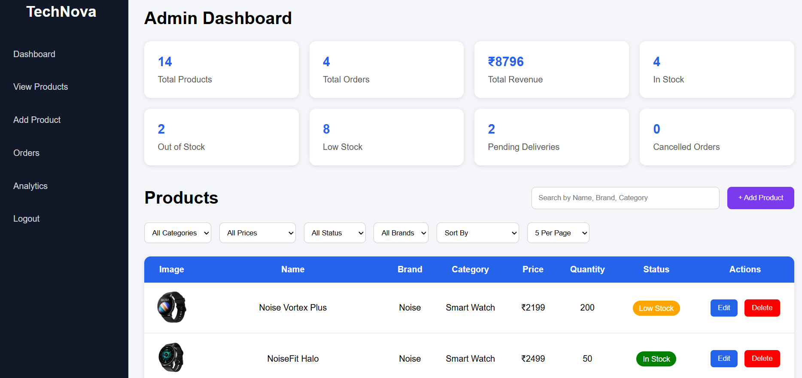
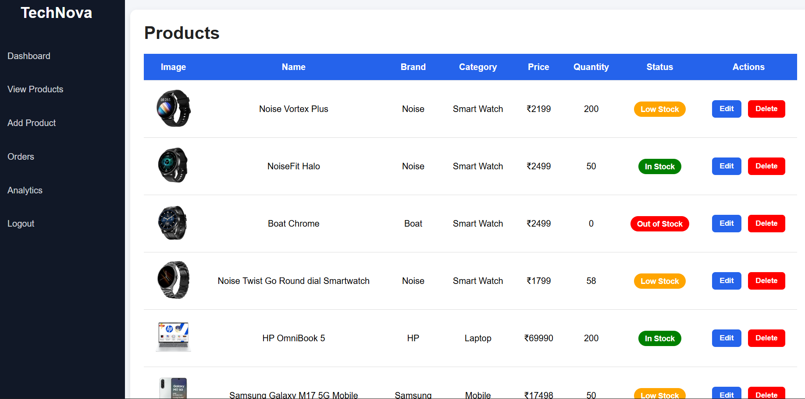
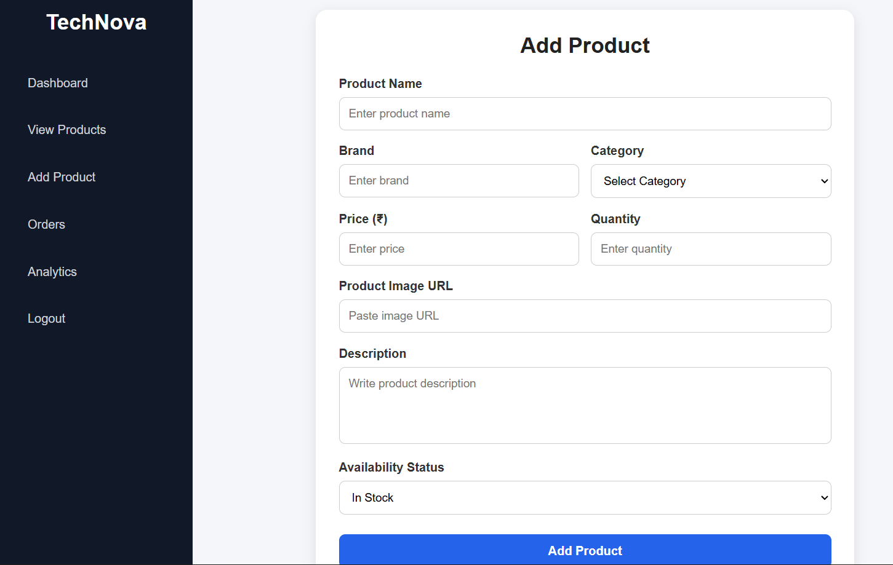
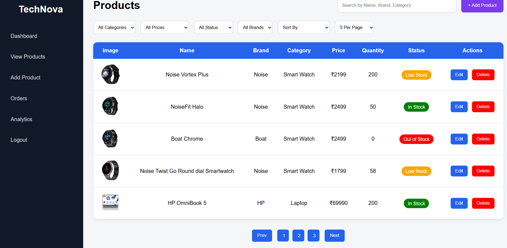
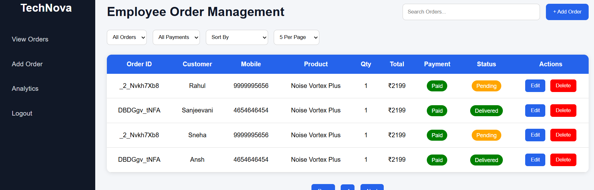
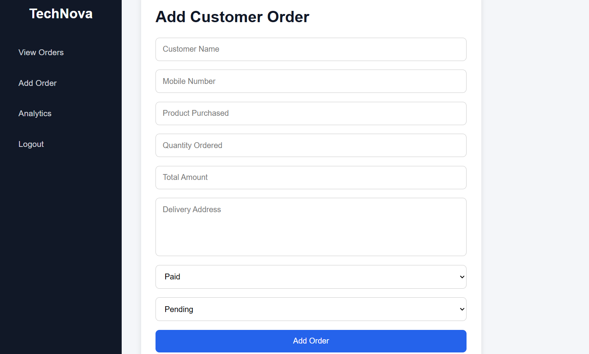

# 🛒 TechNova Store Management System

TechNova Store Management is a web-based store management application built using **HTML, CSS, JavaScript, and JSON Server**.

The application provides separate interfaces for **Administrators** and **Employees** to manage products, inventory, and customer orders.

## Screenshots 

### Admin Dashboard



### Admin Add Product Details


### Admin View Product Details


### Employee View Order Details


### Employee Add Order Details


## ✨ Features

- Product CRUD operations
- Order CRUD operations
- Search and filtering
- Product sorting
- Pagination
- Inventory management
- Order status management
- Payment status tracking
- Dashboard statistics
- Admin and Employee sections

### 👨‍💼 Admin
- View store dashboard
- Add new products
- Edit product details
- Delete products
- Search products
- Filter products
- Sort products
- Manage stock
- Pagination

### 👩‍💻 Employee
- View customer orders
- Add new orders
- Edit orders
- Delete orders
- Track order status
- Track payment status
- View order information

## 🛠️ Technologies Used

- **HTML5** – Structure
- **CSS3** – Styling and layout
- **JavaScript (ES6+)** – Application logic and DOM manipulation
- **JSON Server** – Mock REST API / backend
- **REST API** – Communication with the backend

## 📂 Project Structure

```text
TechNova-Store-Management/
│
├── Admin/
│   ├── ...
│
├── Employee/
│   ├── ...
│
├── db.json
├── index.html
├── style.css
└── README.md
